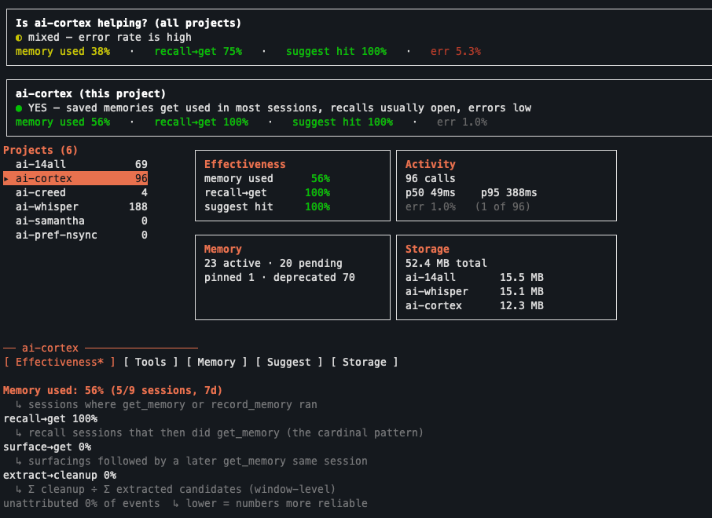

# ai-cortex

`ai-cortex` is a project knowledge substrate for coding agents.

It gives Claude, Codex, Cursor, OpenHands, and similar tools durable project context: the shape of the codebase, past agent sessions, and explicit memories for decisions, gotchas, conventions, and patterns. Everything stays local. The target repository is not modified.

<p align="center">
  
</p>

- Homepage: <https://ai-creed.dev/projects/ai-cortex/>
- npm: <https://www.npmjs.com/package/ai-cortex>
- GitHub: <https://github.com/ai-creed/ai-cortex>

## The Problem

Coding agents forget project knowledge.

They lose architectural constraints between sessions. They repeat mistakes after you corrected them. They rediscover code paths that were already explained. They forget why a project chose one implementation over another.

Most repositories contain code, tests, and some docs. They rarely contain the operational knowledge that makes an engineer effective in that project:

- decisions and the reasoning behind them
- recurring gotchas
- conventions the user stated in conversation
- files and systems that were already investigated
- corrections that should persist into future sessions

`ai-cortex` exists to make that knowledge durable, inspectable, and available to coding agents.

## What It Provides

`ai-cortex` has three main surfaces:

- **Project map:** index a git repo, generate a session briefing, rank relevant files for a task, and inspect function blast radius.
- **Session continuity:** capture compacted agent sessions so future agents can search prior decisions, corrections, file paths, and discussion.
- **Explicit memory:** store typed project memories such as `decision`, `gotcha`, `pattern`, and `how-to`, then surface them when relevant.

These pieces are useful separately, but they compound when used together. A new agent session can start with a project map, recover prior discussion, and consult durable project rules before editing.

## Who It Is For

`ai-cortex` is for experienced engineers who already use coding agents heavily and want project knowledge to survive across sessions.

It is especially aimed at people using Claude Code, Codex CLI, Cursor, OpenHands, Cline, or other MCP-compatible coding agents across real repositories.

It is not optimized for beginner onboarding or generic note-taking.

## What It Is Not

`ai-cortex` is not:

- a vector database
- a generic memory framework
- a RAG abstraction
- hosted intelligence
- autonomous cognition
- orchestration software
- magical agent memory

The philosophy is: **no hidden intelligence in the substrate.**

The system stores, indexes, retrieves, and surfaces developer-controlled project knowledge. It does not secretly reason about your codebase or call an LLM behind your back.

## Quick Start

Requires Node.js 20 or newer and a git repository to analyze.

```bash
npm install -g ai-cortex
ai-cortex --version
```

Index a project:

```bash
ai-cortex index /path/to/repo
```

Register the MCP server so your agent can call ai-cortex tools:

```bash
claude mcp add -s user ai-cortex -- ai-cortex mcp
codex mcp add ai-cortex -- ai-cortex mcp
```

Install capture hooks so future sessions can be searched:

```bash
ai-cortex history install-hooks
```

Install the prompt guide so agents learn the memory usage pattern:

```bash
ai-cortex memory install-prompt-guide
```

After setup, agents can call tools such as `rehydrate_project`, `suggest_files`, `search_history`, `recall_memory`, and `get_memory` through MCP.

## Core Mental Model

`ai-cortex` keeps project knowledge outside the repository:

```text
coding agent
    |
    | MCP tools
    v
ai-cortex
    |
    | local cache
    v
~/.cache/ai-cortex/

target repository is read, not modified
```

There are three layers:

- **Structural:** repo index, imports, functions, call graph, file ranking, blast radius.
- **Continuity:** captured sessions and searchable history.
- **Memory:** durable project rules, decisions, gotchas, patterns, and how-tos.

The key memory pattern is:

```text
recall_memory -> get_memory -> apply the rule
```

`recall_memory` is browse-only. It finds candidate memories but does not mean the agent used them.

`get_memory(id)` fetches the full memory and records the "I am applying this" signal.

That split keeps memory usage inspectable instead of magical.

## Why It Is Different

Most agent memory systems blur storage, retrieval, reasoning, and automation.

`ai-cortex` keeps the substrate boring on purpose:

- local-first storage under `~/.cache/ai-cortex/`
- no writes into the target repository
- MCP surface for agent interoperability
- explicit memory records with lifecycle and audit history
- no hidden LLM calls in the substrate
- developer-controlled promotion, deprecation, cleanup, and inspection

The goal is not to make the agent autonomous. The goal is to make project knowledge durable enough that an agent can work with the context an engineer has already established.

## Inspecting Performance

Run `cortex stats` (or `cortex stats --once` for a snapshot) to open the
dashboard. The top of the overview shows two verdict bands: one
synthesizing "Is ai-cortex helping? (all projects)" across every cached
workspace, and one named after the currently-selected project so a
single workspace's signal is never drowned out by the cross-project
average. Press `?` for an overlay that explains every metric and its
good/ok/bad thresholds (single source of truth:
`src/lib/stats/verdict.ts`).

<p align="center">
  
</p>

To hide a workspace (e.g. a test/smoke-run repo) from the dashboard,
select it with `j/k` and press:

- `e` — exclude (reversible: edit `~/.cache/ai-cortex/v1/stats-config.json`)
- `a` — archive (move cache to `~/.cache/ai-cortex/v1/_archived/<repoKey>/`)
- `x` — clean (prompts y/n; deletes the cache dir, irreversible)

## The Galaxy (`cortex graph`)

`cortex graph` opens an interactive, terminal-styled 3D view of your code and
memories in the browser. It is read-only and reads only from
`~/.cache/ai-cortex`; it never writes into your repositories.

```
cortex graph [--project <path>] [--mode code|memory] [--flat]
             [--semantic] [--port <n>] [--no-open] [--export <file>]
```

Two views over one canvas:

- `code` (default): a project's structure as a static "brain graph" of files,
  imports, and calls, colored by module. Click a file for its blast radius (what
  a change would affect); use the clickable legend to show or hide modules.
  `--flat` renders every file of a repo at once.
- `memory`: a force-directed galaxy of memories across every cached project,
  encoded by category (color and shape), importance (size), and confidence
  (brightness). `--semantic` adds embedding-similarity edges between memories.

The search box runs real ai-cortex retrieval, so you can watch how an agent sees
your work: in code view, `find` matches files and functions by name or path and
`suggest_files` ranks the files for a task; in memory view, search runs
`recall_memory`. Matches highlight in the graph and list in a side panel.

`--export <file>` writes the graph as JSON and exits (no server), for use in
external graph tools.

## Where To Go Next

- [Getting started](./docs/getting-started.md): install, connect an agent, index a repo, capture sessions, and record a first memory.
- [Agent integration](./docs/guides/integrate-with-agents.md): MCP registration, session hooks, prompt guidance, and harness-specific behavior.
- [Troubleshooting](./docs/guides/troubleshooting.md): common setup, cache, MCP, stats, and memory recovery paths.
- [Mental model](./docs/concepts/mental-model.md): project map, session continuity, explicit memory, and no hidden intelligence.
- [Memory model](./docs/concepts/memory-model.md): memory types, scope, lifecycle, recall/use, and what makes a good memory.
- [CLI reference](./docs/reference/cli.md): command groups and common flags.
- [MCP tools](./docs/reference/mcp-tools.md): agent-facing tools and when to use each one.
- [Library API](./docs/reference/library-api.md): public Node.js API for structural indexing and analysis.
- [Language support](./docs/reference/language-support.md): parser-backed language coverage and call graph limits.
- [Benchmarking](./docs/reference/benchmarking.md): performance and ranking-quality benchmark suites.
- [Storage reference](./docs/reference/storage.md): cache layout, local-first boundaries, and rebuildable state.
- [Configuration](./docs/reference/config.md): environment variables, memory config, and agent config touchpoints.
- [Limitations](./docs/reference/limitations.md): current bounds, weak spots, and harness-specific behavior.
- [Architecture overview](./docs/architecture/overview.md): technical system map and data flow.
- [Roadmap](./docs/roadmap.md): shipped foundation, future directions, and non-goals.
- [Docs index](./docs/index.md): full documentation map.
- [Changelog](./CHANGELOG.md): release history.
